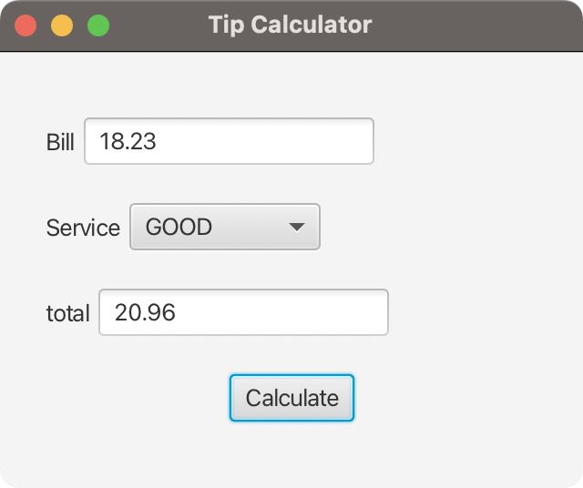

# JavaFX Lab

In this lab, we will write a tip calculator using JavaFX and FXML.

#### Start by looking through the source files in the project.
   - TipApplication.java
      - Starts the application and sets up the initial stage
   - TipController.java
      - Contains the code for interaction with the controls seen on the UI.
      - Note the `@FXML` annotations, which JavaFX uses to link to controls in the FXML file.
      - `initialize()` sets up the scene
   - Service.java
      - Contains the definitions for options that will be available in a dropdown `ChoiceBox`
   - tip-calculator.fxml (found under resources)
      - Contains the UI layout for our project and is linked to `TipController` on line 12.
      
### Run the project

- If you have no current run configuration, use the gradle menu at the right of your IDE.
- Under `JavaFXLab > Tasks > application` double-click "run".

## Required Tasks
To complete this assignment you must do the following:

   1. In `Main >Resources >tip-calculator.fxml` add the top HBox.
       - We will have a label for "Bill"
       - And a `TextField` for the amount billed
          - Give this an id by assigning the property `fx:id="billAmount"` and an initial text value with `text="0.00"`
   2. In `Main > Resources > tip-calculator.fxml` add the middle HBox.
      - Add a label for "Service"
      - Add a `ChoiceBox` and set its `fx:id` property to "quality"
   3. In the Service file add values for tip levels. 
      - Add enum values for GREAT and EXCELLENT similar to the existing entries
      - Ensure that they have a `tip()` override to give their values
   4. In the TipController file add `@FXML` annotated fields for the missing controls
      1. Bill amount will look similar to total.
      2. The quality field will have the type `ChoiceBox<Service>`
   5. In the TipController file for `initialize`, set up the initial UI state.
      1. Call the `.setEditable` method with a `true` argument on the bill amount to make it editable
      2. Call the `.setEditable` method with a `false` argument on the total amount to make it uneditable
      3. Write a for loop over `(Service s: Service.values())`, for each item, call the quality ChoiceBox's 
          `.getItems().add` method to add the service value (just pass it `s`)
      4. Set an initial choice with `.getSelectionModel().select(Service.GOOD)` on the quality control
   6. In the TipController file for `onCalculateClick` add logic to calculate the tip.
      1. Text fields have a `.getText()` method that returns a string of their contents
      2. You can convert that text to a double with `Double.parseDouble`
      3. The current `Service` selected can be acquired with the quality control's `.getSelectionModel().getSelectedItem()` method
      4. Calculate the bill using the selected service's `computeTotal` method and the amount given by the bill control
      5. Use `.setText` to set the text in the total control.